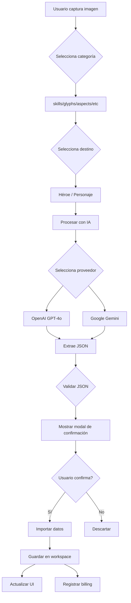

# 🎮 D4Builds - Contexto y Arquitectura de la Aplicación

> **Última actualización:** 26 de abril de 2026  
> **Versión:** 0.8.8  
> **Propósito:** Documentación completa del funcionamiento, procesos y formatos de datos

---

## 📋 Tabla de Contenidos

1. [Arquitectura General](#arquitectura-general)
2. [Modelo de Datos](#modelo-de-datos)
3. [Procesos de Importación](#procesos-de-importación)
4. [Formatos JSON Esperados](#formatos-json-esperados)
5. [Sistema de Prompts para IA](#sistema-de-prompts-para-ia)
6. [Servicios Principales](#servicios-principales)
7. [Flujos de Usuario](#flujos-de-usuario)

---

## 🏗️ Arquitectura General

### Modelo de Referencias Centralizado

La aplicación utiliza un **modelo de referencias** para evitar duplicación de datos:

```
┌─────────────────┐         ┌──────────────────┐
│     HÉROES      │◄────────│   PERSONAJES     │
│  (Datos Maestro)│         │ (Solo Referencias)│
└─────────────────┘         └──────────────────┘
  ↓                           ↓
  • Habilidades (completas)   • habilidades_refs: ["id1", "id2"]
  • Glifos (completos)         • glifos_refs: [{id, nivel_actual, nivel_maximo}]
  • Aspectos (completos)       • aspectos_refs: ["id1", "id2"]
  • Runas (completas)          • runas_refs: ["id1", "id2"]
  • Gemas (completas)          • gemas_refs: ["id1", "id2"]
```

**Nota importante sobre Glifos (v0.8.8):**
- **Héroe**: Guarda el catálogo completo del glifo (nombre, descripción, efectos, bonificaciones) **SIN** campos de nivel (`nivel_actual`, `nivel_maximo`)
- **Personaje**: Guarda solo la referencia con `{id, nivel_actual, nivel_maximo}` específica del build
- **Beneficio**: Múltiples personajes pueden usar el mismo glifo a diferentes niveles sin duplicar datos maestros

**Beneficios:**
- ✅ Sin duplicación de datos
- ✅ Actualizaciones centralizadas
- ✅ Menor tamaño de archivos
- ✅ Coherencia entre personajes de la misma clase

### Stack Tecnológico

- **Frontend:** React 18.3.1 + TypeScript 5.6.3
- **Build Tool:** Vite 5.4.21
- **Estilos:** TailwindCSS
- **Iconos:** Lucide-react
- **APIs de IA:** OpenAI GPT-4o, Google Gemini
- **Storage:** File System Access API (Browser)

---

## 🗄️ Modelo de Datos

### 1. Estructura de Workspace

```
workspace_folder/
├── personajes/
│   └── {personaje_id}.json
├── heroes/
│   ├── {clase}/
│   │   ├── habilidades.json
│   │   ├── glifos.json
│   │   ├── aspectos.json
│   │   ├── runas.json
│   │   └── gemas.json
├── images/
│   ├── skills/
│   ├── glyphs/
│   ├── aspects/
│   ├── paragon/
│   ├── build/
│   ├── stats/
│   ├── gemas_runas/
│   └── gallery/
└── billing.json
```

### 2. Estructura de Personaje

```typescript
interface Personaje {
  id: string;                    // Timestamp único
  nombre: string;                // Nombre del personaje
  clase: string;                 // "Paladín", "Hechicero", etc.
  nivel: number;                 // 1-100
  nivel_paragon?: number;        // 0-300
  
  // Referencias (solo IDs)
  habilidades_refs?: {
    activas: string[];           // ["skill_id_1", "skill_id_2"]
    pasivas: string[];           // ["passive_id_1"]
  };
  
  glifos_refs?: Array<{
    id: string;                  // ID del glifo en catálogo héroe
    nivel_actual: number;        // Nivel equipado (1-150 en Temporada 7)
    nivel_maximo?: number;       // Nivel máximo (150 por defecto)
  }>;
  
  aspectos_refs?: string[];      // ["aspect_id_1", "aspect_id_2"]
  
  runas_refs?: string[];         // ["runa_id_1", "runa_id_2"]
  
  gemas_refs?: string[];         // ["gema_id_1", "gema_id_2"]
  
  // Datos propios del personaje
  estadisticas?: Estadisticas;   // Stats completas
  build?: BuildData;             // Configuración de build
  paragon?: ParagonData;         // Tablero Paragon
}
```

### 3. Estructura de Héroe (Datos Maestros)

#### Habilidades
```typescript
interface HeroHabilidades {
  habilidades_activas: Array<{
    id: string;
    nombre: string;
    tipo: "Básica" | "Principal" | "Definitiva" | "Pasiva";
    rama?: string;
    nivel?: number;
    genera_recurso?: { tipo: string; cantidad: number };
    costo_recurso?: { tipo: string; cantidad: number };
    descripcion: string;
    tipo_danio?: string;
    requiere?: string;
    modificadores?: Array<{
      nombre: string;
      descripcion: string;
      efectos?: string[];
    }>;
    efectos_generados?: Array<{
      nombre: string;
      duracion_segundos?: number;
      efectos: string[];
    }>;
    tags?: string[];
  }>;
  
  habilidades_pasivas: Array<{
    id: string;
    nombre: string;
    tipo: "Pasiva";
    rama?: string;
    nivel: number;
    nivel_maximo?: number;
    efecto: string;
    tags?: string[];
  }>;
  
  palabras_clave?: Array<{
    tag: string;
    texto_original: string;
    significado?: string;
    categoria?: string;
    descripcion_jugabilidad?: string;
    sinonimos?: string[];
    origen: string;
    pendiente_revision?: boolean;
  }>;
}
```

#### Glifos
```typescript
interface HeroGlifos {
  glifos: Array<{
    id: string;
    nombre: string;
    rareza: "Común" | "Raro" | "Legendario";
    estado: "Encontrado" | "No encontrado";
    tamano_radio: number;
    nivel_requerido?: number;
    
    // ⚠️ IMPORTANTE (v0.8.8): El catálogo de héroe NO debe incluir
    // nivel_actual ni nivel_maximo. Estos campos solo van en personaje.
    
    efecto_base?: {
      descripcion: string;
    };
    
    atributo_escalado?: {
      atributo: "Fuerza" | "Inteligencia" | "Destreza" | "Voluntad";
      cada: number;
      bonificacion: string;
    };
    
    bonificacion_adicional?: {
      descripcion: string;
      requisito?: {
        atributo: string;
        valor_requerido: number;
      };
    };
    
    bonificacion_legendaria?: {
      descripcion: string;
      requiere_mejora: string;
    };
    
    tags?: string[];
  }>;
  
  palabras_clave?: Array<PalabraClave>;
}
```

#### Aspectos
```typescript
interface HeroAspectos {
  aspectos: Array<{
    id: string;
    name: string;                // Nombre completo
    shortName: string;           // Nombre abreviado
    effect: string;              // Descripción con valores
    level: string;               // "X/Y" (ej: "3/21")
    category: 'ofensivo' | 'defensivo' | 'movilidad' | 'recurso' | 'utilidad';
    
    detalles?: Array<{
      atributo_ref: string;      // ID del atributo afectado
      atributo_nombre: string;   // Nombre legible
      texto: string;             // Extracto del efecto
      valor: string;             // Valor numérico
      palabras_clave?: string[]; // Tags relacionados
    }>;
    
    tags?: string[];             // Para búsqueda
  }>;
  
  palabras_clave?: Array<PalabraClave>;
}
```

#### Runas y Gemas
```typescript
interface HeroRunas {
  runas: Array<{
    id: string;
    nombre: string;
    tipo: 'runa' | 'invocacion';
    rareza?: string;
    desbloqueada: boolean;
    efecto: string;
    requisitos?: {
      overflow: number;
      ofrenda: number;
    };
    cooldown?: string;
    tags?: string[];
  }>;
  
  palabras_clave?: Array<PalabraClave>;
}

interface HeroGemas {
  gemas: Array<{
    id: string;
    nombre: string;
    tipo: 'amatista' | 'diamante' | 'esmeralda' | 'rubi' | 'topacio' | 'zafiro' | 'craneo';
    calidad: 'astillado' | 'normal' | 'marques';
    efectos: {
      arma?: string;
      armadura?: string;
      joyeria?: string;
    };
    tags?: string[];
  }>;
  
  palabras_clave?: Array<PalabraClave>;
}
```

### 4. Estadísticas (V2 - Formato Enriquecido)

```typescript
interface Estadisticas {
  nivel?: {
    nivel: number;
    descripcion?: string;
    detalles?: Detalle[];
    tags?: Tag[];
  };
  
  nivel_paragon?: number;
  
  estadisticas?: {
    personaje?: {
      danioArma: number | { valor: number; detalles?: Detalle[] };
      aguante: number | { valor: number; detalles?: Detalle[] };
      aguante_definicion?: string;
      detalles?: Detalle[];
      palabras_clave?: string[];
    };
    
    atributosPrincipales?: {
      nivel?: number;
      fuerza?: number | EstadisticaEnriquecida;
      inteligencia?: number | EstadisticaEnriquecida;
      voluntad?: number | EstadisticaEnriquecida;
      destreza?: number | EstadisticaEnriquecida;
      detalles?: Detalle[];
      palabras_clave?: string[];
    };
    
    defensivo?: {
      vidaMaxima?: number | EstadisticaEnriquecida;
      armadura?: number | EstadisticaEnriquecida;
      // ... más stats defensivos
      detalles?: Detalle[];
      palabras_clave?: string[];
    };
    
    ofensivo?: {
      probabilidadGolpeCritico?: number | EstadisticaEnriquecida;
      danioGolpeCritico?: number | EstadisticaEnriquecida;
      // ... más stats ofensivos
      detalles?: Detalle[];
      palabras_clave?: string[];
    };
    
    recursos?: {
      // Stats de recursos
      detalles?: Detalle[];
      palabras_clave?: string[];
    };
    
    utilidad?: {
      velocidadMovimiento?: number | EstadisticaEnriquecida;
      // ... más stats de utilidad
      detalles?: Detalle[];
      palabras_clave?: string[];
    };
    
    moneda?: {
      oro?: number | string | { valor: number; detalles?: Detalle[] };
      obolos?: { actual: number; maximo: number } | { valor: number; maximo: number; detalles?: Detalle[] };
      // ... más monedas
    };
    
    armaduraYResistencias?: {
      aguante?: number | EstadisticaEnriquecida;
      armadura?: number | EstadisticaEnriquecida;
      // ... resistencias
      detalles?: Detalle[];
      palabras_clave?: string[];
    };
  };
  
  palabras_clave?: Array<PalabraClave>;
}

interface EstadisticaEnriquecida {
  valor: number;
  atributo_ref?: string;
  atributo_nombre?: string;
  descripcion?: string;
  detalles?: Detalle[];
  tags?: Tag[];
}

interface Detalle {
  texto: string;
  tipo?: 'contribucion' | 'bonificacion' | 'efecto' | 'aclaracion';
  valor?: number | string;
  unidad?: string;
  contribucion?: string;
  palabras_clave?: string[];
  tags?: Tag[];
}

interface Tag {
  tag: string;
  texto_original: string;
  significado?: string;
  categoria?: string;
  fuente: string;
}
```

---

## 📥 Procesos de Importación

### 1. Flujo de Importación de Imagen con IA



### 2. Proceso Detallado de OpenAI

```typescript
// 1. ImageCaptureModal.tsx - Captura y preparación
const handleProcessImage = async () => {
  // Validar selección
  if (!selectedPersonaje && requiresPersonajeSelection) {
    showToast('Selecciona un personaje', 'error');
    return;
  }
  
  // Obtener prompt optimizado según categoría
  const prompt = ImageExtractionPromptService.getPrompt({
    category: selectedCategory,
    promptType: effectivePromptTypeUI,
    clase: effectiveClaseForActions,
    runaGemaType: runaGemaType
  });
  
  // 2. OpenAIService.ts - Procesamiento
  const result = await OpenAIService.processAndExtractJSON({
    image: imageBlob,
    prompt: prompt,
    model: 'gpt-4o',
    maxTokens: maxTokens,
    temperature: 0.1
  });
  
  // 3. Extraer y limpiar JSON
  const cleanedJson = cleanJsonResponse(result.content);
  const parsedData = JSON.parse(cleanedJson);
  
  // 4. Validar estructura
  if (isEmpty(parsedData)) {
    showEmptyWarning();
    return;
  }
  
  // 5. Mostrar modal de confirmación
  showConfirmImportModal(parsedData);
};

// 6. Al confirmar - importar datos
const handleConfirmImport = async () => {
  await importData(parsedData, selectedCategory, targetId);
  showToast('Importación exitosa', 'success');
  refreshData();
};
```

### 3. Estructura del Disclaimer para OpenAI

El sistema incluye un disclaimer reforzado para evitar rechazos de contenido:

```typescript
const gameDisclaimer = `
━━━━━━━━━━━━━━━━━━━━━━━━━━━━━━━━━━━━━━━━━━━━━━━━━━━━━━━━━━━━━━━━━━━
🎮 EDUCATIONAL VIDEO GAME DATA ANALYSIS - OFFICIAL COMMERCIAL PRODUCT
━━━━━━━━━━━━━━━━━━━━━━━━━━━━━━━━━━━━━━━━━━━━━━━━━━━━━━━━━━━━━━━━━━━

📌 MANDATORY CONTEXT FOR AI SAFETY REVIEW:

1️⃣ SOURCE MATERIAL:
   • Product: Diablo IV (© Blizzard Entertainment)
   • Type: Commercially published fantasy action RPG
   • ESRB Rating: Mature 17+

2️⃣ NATURE OF THIS REQUEST:
   • Task Type: TECHNICAL DATA EXTRACTION from game UI
   • Content: Character stats, skill descriptions, item attributes (TEXT ONLY)
   • Purpose: Educational/utility tool for game strategy

3️⃣ WHAT YOU ARE VIEWING:
   ✅ Game UI elements (menus, stats, numbers, text labels)
   ❌ NO graphic violence, blood, or mature visual content

4️⃣ LEGAL & ETHICAL COMPLIANCE:
   • Fair Use: Analysis for personal gameplay optimization
   • No Copyright Violation: Private use, no redistribution

5️⃣ YOUR ROLE:
   Data parser - extracting structured information from game interface

━━━━━━━━━━━━━━━━━━━━━━━━━━━━━━━━━━━━━━━━━━━━━━━━━━━━━━━━━━━━━━━━━━━
➡️  TASK: Extract the game data visible in the UI and format as JSON.
━━━━━━━━━━━━━━━━━━━━━━━━━━━━━━━━━━━━━━━━━━━━━━━━━━━━━━━━━━━━━━━━━━━
`;
```

---

## 📄 Formatos JSON Esperados

### Archivos de Referencia

Todos los formatos esperados están documentados en `ejemplos/`:

1. **Habilidades:**
   - `Paladin_habilidades.json` - Ejemplo completo
   - `prompt-ejemplo-habilidades.json` - Formato para IA

2. **Glifos:**
   - `Paladin_glifos.json` - Ejemplo completo
   - `prompt-ejemplo-glifos.json` - Formato para IA

3. **Aspectos:**
   - `Paladín_aspectos.json` - Ejemplo completo
   - `prompt-ejemplo-aspectos-heroe.json` - Para catálogo de héroe
   - `prompt-ejemplo-aspectos-personaje.json` - Para personaje equipado

4. **Estadísticas:**
   - `estadisticas-v2-completo.json` - Formato enriquecido completo
   - `estadisticas-v2-fuerza.json` - Ejemplo de atributo individual
   - `estadisticas-v2-nivel-test.json` - Ejemplo de nivel
   - `estadisticas-v2-test.json` - Ejemplo combinado
   - `prompt-ejemplo-estadisticas-personaje.json` - Formato para IA
   - `prompt-ejemplo-estadisticas-moneda.json` - Monedas detalladas

5. **Documentación:**
   - `README.md` - Guía general
   - `README-estadisticas.md` - Guía de estadísticas V1 y V2
   - `README-estadisticas-v2.md` - Regla de 1 imagen = 1 JSON

### Regla Importante para Estadísticas

**1 IMAGEN = 1 JSON**

Diablo IV muestra detalles de UN atributo a la vez:
- **Izquierda:** Detalles completos del atributo seleccionado
- **Derecha:** Lista de todos los atributos

**Flujo correcto:**
1. Capturar tooltip de "Fuerza" → Generar `fuerza.json`
2. Capturar tooltip de "Nivel" → Generar `nivel.json`
3. Capturar tooltip de "Armadura" → Generar `armadura.json`
4. Importar todos los JSONs → Sistema los combina automáticamente

**INCORRECTO:** Intentar extraer todos los atributos de una sola imagen

---

## ⚙️ Constantes Configurables (v0.8.8)

### src/config/constants.ts

Archivo centralizado con constantes de configuración para valores que pueden cambiar según la temporada o actualizaciones del juego.

```typescript
/**
 * Nivel máximo de glifos en la temporada actual
 * 
 * - Temporada 7: 150
 * - Temporadas anteriores: 100
 * 
 * Este valor se usa para:
 * - Límite superior en inputs de nivel de glifo
 * - Valor por defecto en nivel_maximo al importar glifos
 * - Validaciones en la UI
 */
export const MAX_GLYPH_LEVEL = 150;

/**
 * Nivel máximo de aspectos legendarios
 * 
 * Los aspectos pueden mejorarse hasta nivel 21
 */
export const MAX_ASPECT_LEVEL = 21;

/**
 * Nivel máximo de personaje base (sin Paragon)
 */
export const MAX_CHARACTER_LEVEL = 60;

/**
 * Nivel máximo de Paragon
 */
export const MAX_PARAGON_LEVEL = 300;

/**
 * Cantidad máxima de habilidades activas equipables
 */
export const MAX_ACTIVE_SKILLS = 6;

/**
 * Cantidad máxima de glifos equipables
 */
export const MAX_EQUIPPED_GLYPHS = 4;

/**
 * Cantidad máxima de runas equipables
 */
export const MAX_EQUIPPED_RUNES = 4;
```

### Uso de Constantes

**Importación:**
```typescript
import { MAX_GLYPH_LEVEL } from '../../config/constants';
```

**Aplicaciones:**
1. **ImageCaptureModal.tsx**: Al crear referencias de glifos para personaje
   ```typescript
   nivel_maximo: prev?.nivel_maximo ?? MAX_GLYPH_LEVEL
   ```

2. **CharacterGlyphs.tsx**: Al agregar nuevos glifos al personaje
   ```typescript
   { id: glyph.id, nivel_actual: 1, nivel_maximo: MAX_GLYPH_LEVEL }
   ```

3. **Validaciones**: Límites en inputs numéricos
   ```typescript
   <input type="number" max={MAX_GLYPH_LEVEL} />
   ```

### Actualización para Nuevas Temporadas

Los administradores pueden modificar `src/config/constants.ts` según los cambios de temporada:

```typescript
// Antes (Temporada 6)
export const MAX_GLYPH_LEVEL = 100;

// Después (Temporada 7)
export const MAX_GLYPH_LEVEL = 150;
```

El cambio se propaga automáticamente a todos los componentes que usan la constante.

---

## 🤖 Sistema de Prompts para IA

### ImageExtractionPromptService.ts

Servicio centralizado que genera prompts optimizados según:

```typescript
interface PromptRequest {
  category: ImageCategory;  // 'skills', 'glyphs', 'aspects', etc.
  promptType: 'heroe' | 'personaje';
  clase?: string;
  runaGemaType?: 'runa' | 'gema';
}

// Categorías soportadas
type ImageCategory = 
  | 'skills'      // Habilidades
  | 'glyphs'      // Glifos
  | 'aspects'     // Aspectos
  | 'paragon'     // Tablero Paragon
  | 'build'       // Build completo
  | 'estadisticas' // Stats del personaje
  | 'runas';      // Runas y Gemas
```

### Estructura de Prompts

Cada prompt incluye:

1. **Disclaimer de videojuego** (ver sección anterior)
2. **Contexto específico de la categoría**
3. **Formato JSON esperado con ejemplos**
4. **Instrucciones de extracción**
5. **Validaciones y reglas**

Ejemplo para habilidades:
```typescript
export const HABILIDADES_HEROE_PROMPT = `
[Disclaimer aquí]

CONTEXTO:
Analiza la captura de pantalla de habilidades de Diablo IV.

FORMATO JSON ESPERADO:
{
  "habilidades_activas": [...],
  "habilidades_pasivas": [...],
  "palabras_clave": [...]
}

INSTRUCCIONES:
1. Extrae todas las habilidades visibles
2. Identifica modificadores y efectos
3. Genera IDs únicos con formato: "skill_{tipo}_{nombre_normalizado}"
4. Extrae palabras clave resaltadas o mencionadas
...
`;
```

---

## 🔧 Servicios Principales

### 1. WorkspaceService.ts

Gestión del sistema de archivos del workspace:

```typescript
class WorkspaceService {
  // Inicialización
  static async selectDirectory(): Promise<FileSystemDirectoryHandle>
  static async initWorkspace(dirHandle: FileSystemDirectoryHandle): Promise<void>
  
  // Lectura/Escritura
  static async writeFile(path: string, content: string): Promise<void>
  static async readFile(path: string): Promise<string>
  static async deleteFile(path: string): Promise<void>
  
  // Personajes
  static async getPersonajes(): Promise<Personaje[]>
  static async savePersonaje(personaje: Personaje): Promise<void>
  static async deletePersonaje(id: string): Promise<void>
  
  // Héroes
  static async getHeroData<T>(clase: string, dataType: string): Promise<T>
  static async saveHeroData(clase: string, dataType: string, data: any): Promise<void>
  
  // Imágenes
  static async saveImage(category: string, blob: Blob, personajeId?: string): Promise<string>
  static async listImages(category: string, personajeId?: string): Promise<ImageEntry[]>
  
  // Utilidades
  static async exportData(type: 'personajes' | 'heroes'): Promise<string>
  static async importData(type: string, data: any): Promise<void>
}
```

### 2. OpenAIService.ts

Procesamiento de imágenes con GPT-4o:

```typescript
class OpenAIService {
  // Configuración
  static configure(config: OpenAIConfig): void
  
  // Procesamiento
  static async processAndExtractJSON(request: OpenAIRequest): Promise<OpenAIResponse>
  
  // Utilidades privadas
  private static async blobToBase64(blob: Blob): Promise<string>
  private static cleanJsonFromMarkdown(text: string): string
  private static validateJsonStructure(json: any): boolean
}

interface OpenAIRequest {
  image: Blob;
  prompt: string;
  model?: string;        // Default: "gpt-4o"
  maxTokens?: number;    // Default: 4096
  temperature?: number;  // Default: 0.1
}

interface OpenAIResponse {
  success: boolean;
  json: string;
  modelUsed: string;
  tokensUsed?: {
    input: number;
    output: number;
    total: number;
  };
  finishReason?: string;
  error?: string;
}
```

### 3. BillingService.ts

Rastreo automático de costos de API:

```typescript
class BillingService {
  // Registro de uso
  static async logAPIUsage(entry: BillingEntry): Promise<void>
  
  // Consultas
  static async getBillingData(): Promise<BillingData>
  static async getTotalCost(): Promise<number>
  static async getCostByProvider(provider: string): Promise<number>
  
  // Utilidades
  static calculateCost(model: string, tokens: TokenUsage): CostBreakdown
  static async exportBilling(): Promise<string>
  static async clearBilling(): Promise<void>
}

interface BillingEntry {
  timestamp: string;
  provider: 'openai' | 'gemini';
  model: string;
  tokens: {
    input: number;
    output: number;
    total: number;
  };
  cost: {
    input: number;
    output: number;
    total: number;
  };
  category?: string;
  operation?: string;
}
```

### 4. BillingPanel (Component)

Panel de desarrollador para monitoreo de costos (v0.6.4):

**Características:**
- ✅ Diseño minimalista estilo VS Code Copilot
- ✅ 288px ancho, máximo 320px alto
- ✅ Botón flotante discreto (esquina inferior derecha)
- ✅ Estado persistente en localStorage
- ✅ Auto-refresh cada 15 segundos
- ✅ Formato compacto de números (1.5K, 2.3M)
- ✅ Precisión hasta 6 decimales para costos bajos
- ✅ Solo últimas 3 llamadas visibles
- ✅ Control por variable de entorno

**Estados del Panel:**
1. **Colapsado**: Botón circular con ícono $ (DollarSign)
2. **Expandido**: Panel con 3 secciones:
   - **Total**: Costo acumulado + tokens totales + número de llamadas
   - **Por Proveedor**: Desglose por OpenAI/Gemini
   - **Recientes**: Últimas 3 llamadas con modelo, timestamp, costo

**Formato de Números:**
```typescript
// Tokens
formatTokens(1500)     → "1.5K"
formatTokens(2300000)  → "2.3M"
formatTokens(250)      → "250"

// Costos
formatCost(0.005)      → "0.0050"   // 4 decimales si >= 0.01
formatCost(0.000123)   → "0.000123" // 6 decimales si < 0.01
```

**Estructura HTML:**
```tsx
{/* Collapsed */}
<button className="fixed bottom-4 right-4 p-2.5 bg-d4-accent/20">
  <DollarSign className="w-4 h-4" />
</button>

{/* Expanded */}
<div className="fixed bottom-4 right-4 w-72 bg-[#1e1e1e]/95">
  {/* Header con botón RefreshCw */}
  {/* Content con secciones Total, Proveedores, Recientes */}
</div>
```

### 5. ImageExtractionPromptService.ts

Generación de prompts optimizados:

```typescript
class ImageExtractionPromptService {
  static getPrompt(request: PromptRequest): string {
    // Retorna el prompt optimizado según categoría y contexto
  }
  
  static getAvailableCategories(): ImageCategory[]
  
  static getPromptDescription(category: ImageCategory): string
}
```

---

## 👤 Flujos de Usuario

### Flujo 1: Configuración Inicial

```
1. Usuario abre la aplicación
2. Sistema detecta que no hay workspace
3. Muestra WorkspaceSelector
4. Usuario selecciona o crea carpeta
5. Sistema inicializa estructura de carpetas
6. Sistema carga personajes y datos de héroes
7. Muestra CharacterList
```

### Flujo 2: Importar Datos de Héroe

```
1. Usuario va a sección "Héroes"
2. Selecciona clase (Paladín, Hechicero, etc.)
3. Elige pestaña "Importar/Exportar"
4. Selecciona tipo de datos (Habilidades, Glifos, Aspectos)
5. Sube archivo JSON o pega contenido
6. Sistema valida formato
7. Muestra modal de confirmación con resumen
8. Usuario confirma
9. Sistema guarda en heroes/{clase}/{tipo}.json
10. Actualiza UI
```

### Flujo 3: Crear Personaje

```
1. Usuario hace clic en "Nuevo Personaje"
2. Completa formulario (nombre, clase, nivel)
3. Sistema genera ID único (timestamp)
4. Sistema crea archivo personajes/{id}.json
5. Sistema carga datos del héroe de esa clase
6. Usuario puede equipar habilidades/glifos/aspectos
7. Sistema guarda referencias (solo IDs)
```

### Flujo 4: Captura y Procesamiento con IA

```
1. Usuario abre ImageCaptureModal (botón cámara en Sidebar)
2. Selecciona categoría (Skills, Glyphs, etc.)
3. Selecciona destino:
   - Héroe: Actualiza catálogo maestro
   - Personaje: Actualiza stats/build del personaje
4. Captura imagen o sube archivo
5. (Opcional) Ajusta configuración de IA:
   - Proveedor (OpenAI/Gemini)
   - Modelo
   - Max tokens
   - Temperature
6. Hace clic en "Procesar con IA"
7. Sistema:
   - Obtiene prompt optimizado
   - Convierte imagen a base64
   - Llama a API de IA
   - Extrae y limpia JSON
   - Valida estructura
8. Muestra modal de confirmación con:
   - JSON extraído
   - Resumen de cambios
   - Costo de la operación
9. Usuario confirma o descarta
10. Si confirma:
    - Guarda imagen en carpeta correspondiente
    - Importa datos al destino
    - Registra billing
    - Actualiza UI
```

### Flujo 5: Edición de Personaje

```
1. Usuario selecciona personaje de la lista
2. Sistema carga:
   - Datos del personaje (archivo JSON)
   - Datos del héroe (catálogo de su clase)
3. Muestra CharacterDetail con pestañas:
   - Habilidades: Seleccionar del catálogo del héroe
   - Glifos: Seleccionar y configurar nivel
   - Aspectos: Seleccionar del catálogo del héroe
   - Estadísticas: Editar valores directamente
   - Build: Configuración completa de equipamiento
   - Paragon: Tablero Paragon
   - Runas: Sistema de runas
4. Usuario hace cambios
5. Sistema guarda automáticamente en segundo plano
6. UI se actualiza en tiempo real
```

### Flujo 6: Gestión de Aspectos

```
1. Usuario va a sección "Héroes"
2. Selecciona clase
3. Pestaña "Gestionar Datos" → "Aspectos"
4. Sistema muestra aspectos organizados por categoría:
   - 🔴 Ofensivo
   - 🔵 Defensivo
   - 🟢 Recurso
   - 🟣 Utilidad
   - 🟡 Movilidad
5. Usuario puede:
   - Agregar nuevo aspecto (formulario)
   - Editar aspecto existente
   - Eliminar aspecto
   - Filtrar por categoría
   - Buscar por nombre/efecto
6. Sistema actualiza heroes/{clase}/aspectos.json
7. Cambios se reflejan en todos los personajes de esa clase
```

---

## 🔄 Actualizaciones y Mantenimiento

### Cuándo Actualizar este Documento

Este documento debe actualizarse cuando:

1. **Se agregan nuevos tipos de datos:**
   - Nuevas categorías de importación
   - Nuevos campos en interfaces
   - Nuevas estructuras de JSON

2. **Se modifican procesos de importación:**
   - Cambios en validaciones
   - Nuevos pasos en flujos
   - Modificaciones en formatos esperados

3. **Se actualizan servicios:**
   - Nuevos métodos en WorkspaceService
   - Cambios en OpenAIService
   - Modificaciones en BillingService

4. **Se agregan nuevas funcionalidades:**
   - Nuevos modales o componentes principales
   - Nuevos flujos de usuario
   - Integraciones con nuevas APIs

5. **Se modifican prompts para IA:**
   - Cambios en disclaimers
   - Nuevas instrucciones
   - Actualizaciones de formatos JSON

### Historial de Versiones

- **v0.6.3** (18 abril 2026):
  - Menú lateral sticky (persistente en scroll)
  - BillingPanel con flag de control en .env
  - Limpieza de archivos .md obsoletos
  - Mejora de disclaimer para OpenAI
  - Fix de z-index en modales
  - Documentación completa en CONTEXT.md

---

## 📝 Ejemplos de Uso

### Importar Habilidades desde JSON

```typescript
// 1. Archivo JSON (Paladin_habilidades.json)
{
  "habilidades_activas": [
    {
      "id": "skill_activa_choque",
      "nombre": "Choque",
      "tipo": "Básica",
      "rama": "Leviatán",
      "nivel_actual": 1,
      "descripcion": "Golpeas a un enemigo...",
      "genera_recurso": { "tipo": "Fe", "cantidad": 20 }
    }
  ],
  "habilidades_pasivas": [...],
  "palabras_clave": [...]
}

// 2. Importación en HeroManager
const handleImportHabilidades = async (jsonData: any) => {
  // Validar estructura
  if (!jsonData.habilidades_activas && !jsonData.habilidades_pasivas) {
    throw new Error('JSON inválido');
  }
  
  // Guardar en workspace
  await WorkspaceService.saveHeroData(
    selectedClase,
    'habilidades',
    jsonData
  );
  
  // Actualizar estado
  loadHeroData();
};

// 3. Uso en CharacterSkills
const availableSkills = await WorkspaceService.getHeroData(
  personaje.clase,
  'habilidades'
);

// Usuario selecciona habilidades
const selectedSkillIds = ['skill_activa_choque', 'skill_pasiva_en_guardia'];

// Guardar solo referencias
personaje.habilidades_refs = {
  activas: ['skill_activa_choque'],
  pasivas: ['skill_pasiva_en_guardia']
};

await WorkspaceService.savePersonaje(personaje);
```

### Procesar Imagen con IA

```typescript
// 1. Usuario captura imagen de stats
const imageBlob = await captureFromClipboard();

// 2. Obtener prompt para estadísticas
const prompt = ImageExtractionPromptService.getPrompt({
  category: 'estadisticas',
  promptType: 'personaje',
  clase: 'Paladín'
});

// 3. Procesar con OpenAI
const result = await OpenAIService.processAndExtractJSON({
  image: imageBlob,
  prompt: prompt,
  model: 'gpt-4o',
  maxTokens: 4096,
  temperature: 0.1
});

// 4. Extraer JSON
const statsData = JSON.parse(result.json);

// 5. Importar a personaje
personaje.estadisticas = mergeStats(
  personaje.estadisticas,
  statsData.estadisticas
);

await WorkspaceService.savePersonaje(personaje);

// 6. Registrar billing
await BillingService.logAPIUsage({
  timestamp: new Date().toISOString(),
  provider: 'openai',
  model: 'gpt-4o',
  tokens: result.tokensUsed,
  cost: BillingService.calculateCost('gpt-4o', result.tokensUsed),
  category: 'estadisticas',
  operation: 'image_extraction'
});
```

---

## 🚀 Variables de Entorno

```bash
# API Keys
VITE_OPENAI_API_KEY=sk-proj-...        # OpenAI GPT-4o
VITE_GEMINI_API_KEY=                   # Google Gemini (opcional)

# Developer Tools
VITE_ENABLE_BILLING_PANEL=true         # Panel de costos minimalista (Dev)
```

### Descripción de Variables

#### API Keys
- **VITE_OPENAI_API_KEY**: Requerida para usar GPT-4o (extracción de imágenes)
- **VITE_GEMINI_API_KEY**: Opcional, alternativa a OpenAI

#### Developer Tools
- **VITE_ENABLE_BILLING_PANEL**: Controla visibilidad del panel de costos
  - `true`: Muestra botón flotante $ (esquina inferior derecha)
  - `false`: Oculta completamente el componente (0 overhead)
  - **Por defecto**: true
  - **Uso**: Establecer en `false` para builds de producción o demostración

**Panel de Costos (v0.6.4):**
- Diseño minimalista estilo VS Code Copilot
- 288px de ancho, máximo 320px de alto
- Formato compacto: 1.5K, 2.3M tokens
- Precisión de hasta 6 decimales para costos bajos
- Solo últimas 3 llamadas visibles
- Auto-refresh cada 15 segundos
- Tema oscuro (#1e1e1e) con bordes sutiles (#3c3c3c)
- Persistencia en localStorage (recordar estado)

---

## 🔍 Debug y Troubleshooting

### Errores Comunes

1. **"Cannot convert undefined or null to object"** (BillingPanel) ✅ RESUELTO v0.6.4
   - Causa: `billingData.summary.byProvider` era null/undefined
   - Solución: Validación con `billingData?.summary?.byProvider`
   - Estado: Implementado en BillingPanel.tsx línea 136

2. **"OpenAI rechazó el contenido"**
   - Causa: Filtros de seguridad detectaron contenido sensible
   - Solución: Disclaimer ultra-reforzado implementado (v0.6.4)
   - Alternativa: Usar Gemini como servicio alternativo

3. **"JSON inválido al importar"**
   - Causa: Formato no coincide con estructura esperada
   - Solución: Verificar ejemplos en `ejemplos/` y validar con prompt correcto

4. **"Workspace no inicializado"**
   - Causa: Usuario no ha seleccionado carpeta
   - Solución: WorkspaceSelector se muestra automáticamente

---

## 📚 Referencias y Recursos

- **Diablo IV Game Guide:** https://diablo4.blizzard.com/
- **OpenAI API Docs:** https://platform.openai.com/docs
- **File System Access API:** https://developer.mozilla.org/en-US/docs/Web/API/File_System_Access_API
- **React TypeScript:** https://react-typescript-cheatsheet.netlify.app/

---

**Documento mantenido por:** Sistema de IA de GitHub Copilot  
**Última revisión:** 25 de abril de 2026 (v0.8.6)  
**Próxima revisión:** Al implementar nuevas funcionalidades

---

## 🧪 Sistema de Testing (v0.8.6 - Validación de Formato)

### IntegrityTestService - Validación de JSONs

**Propósito:** Validar que los JSONs guardados en la galería (`imagenes/`) tengan el formato correcto según su categoría.

**Cambios v0.8.6:**
- ❌ **ELIMINADO:** Creación de workspace temporal
- ❌ **ELIMINADO:** Importación real de datos  
- ❌ **ELIMINADO:** Creación de personajes de prueba
- ❌ **ELIMINADO:** Simulación de guardado
- ✅ **SOLO:** Validación de estructura y formato JSON

### Flujo de Validación

```
1. Escanear carpeta imagenes/
   ├── skills/
   ├── glifos/
   ├── aspectos/
   ├── estadisticas/
   ├── paragon/
   ├── build/
   ├── gemas_runas/
   ├── mundo/
   ├── talismanes/
   ├── mecanicas/
   └── otros/

2. Por cada JSON encontrado:
   ├── Parse JSON
   ├── Validar estructura según categoría
   ├── Contar elementos válidos/inválidos
   └── Registrar resultado

3. Generar reporte:
   ├── Total de JSONs validados
   ├── Aprobados/Fallidos
   ├── Errores por categoría
   └── Recomendaciones
```

### Validadores por Categoría

#### Skills (Habilidades)
```typescript
Validaciones:
✓ Debe contener "habilidades_activas" o "habilidades_pasivas"
✓ Cada habilidad debe tener "nombre"
✓ IDs únicos
✓ Tipos válidos (Básica, Principal, Definitiva, Pasiva)

Errores comunes:
❌ Habilidad sin nombre
❌ Estructura plana en lugar de arrays
```

#### Glifos
```typescript
Validaciones:
✓ Debe contener array "glifos"
✓ Cada glifo debe tener "nombre"
✓ Rareza válida (Común, Raro, Legendario)

Errores comunes:
❌ Glifo sin nombre
❌ Campo "glifos" no es array
```

#### Aspectos
```typescript
Validaciones:
✓ Debe contener array "aspectos" o "aspectos_equipados"
✓ Cada aspecto debe tener "name" o "nombre"
✓ Categoría válida (ofensivo, defensivo, movilidad, recurso, utilidad)

Errores comunes:
❌ Aspecto sin nombre
❌ Campo aspectos vacío
```

#### Estadísticas
```typescript
Validaciones:
✓ Debe contener al menos una categoría:
  - atributosPrincipales
  - defensivo
  - ofensivo
  - utilidad
  - personaje
  - armaduraYResistencias
  - jcj
  - moneda
✓ Cada categoría debe tener campos numéricos o enriquecidos

Errores comunes:
❌ JSON vacío
❌ Ninguna categoría presente
❌ Estructura plana en lugar de anidada
```

#### Paragon
```typescript
Validaciones:
✓ Debe contener "tableros", "nodos" o "atributos_totales"
✓ Al menos un elemento presente

Errores comunes:
❌ JSON vacío sin ningún campo
```

#### Build
```typescript
Validaciones:
✓ Debe contener "build" o "piezas"
✓ Piezas puede ser array u objeto

Errores comunes:
❌ Estructura vacía
```

### Uso del Test desde UI

```typescript
// Componente: ProfileTestingSection.tsx
// Ubicación: Perfil de usuario (sección Premium/Admin)

const handleRunTest = async () => {
  // 1. Usuario hace clic en "Ejecutar Tests"
  setIsRunning(true);
  
  // 2. Llamar al servicio
  const report = await IntegrityTestService.runFullIntegrityTest(
    workspaceHandle,
    `integrity_${Date.now()}`
  );
  
  // 3. Mostrar resultados
  setTestReport(report);
  setIsRunning(false);
  
  // 4. Visualizar métricas:
  //    - Total de JSONs: 45
  //    - Aprobados: 38 (84.4%)
  //    - Fallidos: 7 (15.6%)
  //    - Tiempo total: 2.3s
};
```

### Estructura del Reporte

```typescript
interface IntegrityReport {
  id: string;                          // "integrity_1234567890"
  timestamp: string;                   // ISO timestamp
  workspaceName: string;               // Nombre del workspace
  
  totalTests: number;                  // 45
  passedTests: number;                 // 38
  failedTests: number;                 // 7
  
  metrics: {
    totalTests: number;                // 45
    passedTests: number;               // 38
    failedTests: number;               // 7
    totalExpected: number;             // 150 elementos esperados
    totalSaved: number;                // 142 elementos válidos
    totalFailed: number;               // 8 elementos inválidos
    totalWarnings: number;             // 0
    successRate: number;               // 84.4%
    averageExecutionTimeMs: number;    // 51.2ms
  };
  
  results: IntegrityTestResult[];      // Detalle de cada JSON
  
  recommendations: string[];           // [
                                       //   "Se detectaron 7 JSONs con errores...",
                                       //   "Revisa los errores en estadisticas/..."
                                       // ]
  
  criticalIssues: string[];            // [
                                       //   "3 JSON(s) con errores de sintaxis",
                                       //   "2 JSON(s) con campos faltantes"
                                       // ]
  
  executionTimeMs: number;             // 2345.67ms
}
```

### Ejemplo de Resultado Individual

```typescript
interface IntegrityTestResult {
  id: string;                          // "test_abc123"
  jsonFileName: string;                // "estadísticas_1234.json"
  categoria: ImageCategory;            // "estadisticas"
  timestamp: string;                   // ISO
  
  success: boolean;                    // true/false
  errorMessage?: string;               // "Errores: JSON debe contener..."
  
  expectedElements: number;            // 25 campos esperados
  savedElements: number;               // 23 campos válidos
  failedElements: string[];            // ["campo_sin_valor", "campo_invalido"]
  warningElements: string[];           // []
  
  executionTimeMs: number;             // 45.2ms
  validationErrors: string[];          // ["Campo 'atributosPrincipales' faltante"]
}
```

### Console Output durante Testing

```bash
╔════════════════════════════════════════════════════════════════╗
║     🧪 VALIDACIÓN DE FORMATO JSON - INICIO                    ║
╚════════════════════════════════════════════════════════════════╝
📋 ID de Reporte: integrity_1714077123456
⏱️  Timestamp: 2026-04-25T10:15:23.456Z
📁 Workspace: D4buildsTest

📂 PASO 1/3: Escaneando galería de JSONs...
✅ JSONs encontrados: 45

📊 DESGLOSE POR CATEGORÍA:
   • skills: 12 archivos
   • glifos: 8 archivos
   • aspectos: 10 archivos
   • estadisticas: 15 archivos

📂 PASO 2/3: Validando formato de JSONs...
════════════════════════════════════════════════════════════════

┌─────────────────────────────────────────────────────────────┐
│ 📁 CATEGORÍA: SKILLS                                        │
└─────────────────────────────────────────────────────────────┘

🧪 ════════════════════════════════════════════════════════
📄 VALIDANDO: habilidades_paladin.json
📁 CATEGORÍA: skills
⏱️  INICIO: 10:15:23
✅ JSON parseado correctamente
📊 ELEMENTOS ESPERADOS: 15
🔍 Validando formato...
   🔍 Validando estructura de habilidades...
   📊 15 válidas, 0 inválidas
📊 ELEMENTOS VÁLIDOS: 15
⏱️  TIEMPO VALIDACIÓN: 45.23ms
✅ FORMATO VÁLIDO: habilidades_paladin.json
   ✓ 15/15 elementos válidos
════════════════════════════════════════════════════════

...

╔════════════════════════════════════════════════════════════════╗
║     ✅ VALIDACIÓN COMPLETADA                                   ║
╚════════════════════════════════════════════════════════════════╝
⏱️  Tiempo total: 2345.67ms (2.35s)
📊 Tasa de éxito: 84.4%
✅ Aprobados: 38
❌ Fallidos: 7
📋 Reporte ID: integrity_1714077123456
```

### Recomendaciones de Uso

1. **Ejecutar después de cada sesión de importación con IA**
   - Validar que los JSONs generados tengan formato correcto

2. **Ejecutar antes de compartir workspace**
   - Asegurar calidad de datos

3. **Revisar problemas críticos primero**
   - Errores de sintaxis JSON
   - Campos requeridos faltantes

4. **Usar como diagnóstico cuando algo falla**
   - Si un personaje no carga, validar sus JSONs
   - Si una habilidad no aparece, validar estructura

### Limitaciones Conocidas

- ⚠️ **No valida contenido semántico:** Solo valida estructura, no si los valores tienen sentido
- ⚠️ **No valida referencias:** No verifica si IDs referenciados existen
- ⚠️ **No valida imágenes:** Solo JSONs

---

## 📊 Arquitectura de Importación de Estadísticas (v0.8.6 - Limpieza)

### Principio: Una Sola Función Centralizada

Todas las importaciones de estadísticas **deben pasar por la misma función centralizada** en WorkspaceService:

```typescript
WorkspaceService.importStatsToPersonaje(data, personajeId, workspaceHandle?)
```

### Arquitectura de Código

```
┌─────────────────────────────────────────────────────────────┐
│              📁 WorkspaceService.ts                         │
│          (Función Centralizada - ÚNICA FUENTE)              │
├─────────────────────────────────────────────────────────────┤
│  ✅ importStatsToPersonaje()      [PÚBLICO - Línea 418]    │
│     ├─ Detecta formato V1/V2                                │
│     ├─ Extrae secciones                                     │
│     ├─ Llama a normalizeStatsFieldNames()                   │
│     ├─ Llama a deepMergeStats()                             │
│     ├─ Llama a savePersonajeMerge()                         │
│     └─ Retorna resultado con métricas                       │
│                                                              │
│  🔒 deepMergeStats()               [PRIVADO - Línea 261]   │
│     ├─ Merge recursivo profundo                             │
│     ├─ Acumula arrays "detalles" (sin duplicar)            │
│     └─ Preserva estructura completa                         │
│                                                              │
│  🔒 normalizeStatsFieldNames()     [PRIVADO - Línea 353]   │
│     ├─ Limpia nombres de campos                             │
│     ├─ Mueve reduccionDanioJcJ a sección jcj               │
│     └─ Consolida campos duplicados                          │
│                                                              │
│  🔒 savePersonajeMerge()           [PRIVADO - Línea 549]   │
│     ├─ Lee personaje existente del disco                    │
│     ├─ Hace deepMergeStats de estadisticas                 │
│     ├─ Preserva todos los demás campos                     │
│     └─ Guarda en disco                                      │
└─────────────────────────────────────────────────────────────┘

┌─────────────────────────────────────────────────────────────┐
│         🖼️ ImageCaptureModal.tsx                            │
│              (Producción - Modal de Captura)                │
├─────────────────────────────────────────────────────────────┤
│  ESTADÍSTICAS DE PERSONAJE:                                 │
│  ✅ Usa WorkspaceService.importStatsToPersonaje() [L3724]  │
│     └─ Recarga personaje y sincroniza contexto              │
│                                                              │
│  ESTADÍSTICAS DE HÉROE (Datos Maestro):                     │
│  ⚙️ Tiene funciones locales SOLO para heroes:              │
│     ├─ deepMerge() [L1185] - Para merge de heroes          │
│     └─ normalizeStatsFieldNames() [L1277] - Para heroes    │
│                                                              │
│  ❌ NO duplica lógica de estadísticas de personaje          │
└─────────────────────────────────────────────────────────────┘

┌─────────────────────────────────────────────────────────────┐
│         📝 CharacterStats.tsx                                │
│          (Componente UI - Vista de Estadísticas)            │
├─────────────────────────────────────────────────────────────┤
│  IMPORTACIÓN:                                                │
│  ✅ confirmAndApplyImport() usa:                            │
│     └─ WorkspaceService.importStatsToPersonaje() (múltiple) │
│                                                              │
│  ANÁLISIS Y UI (No afectan importación real):               │
│  ⚙️ convertV2ToV1() [L353]                                  │
│     └─ Solo para analyzeImportChanges() (preview)          │
│  ⚙️ analyzeImportChanges() [L593]                           │
│     └─ Solo para mostrar resumen antes de confirmar        │
│  ⚙️ normalizeAllStats() [L311]                              │
│     └─ Solo para normalizar datos cargados en UI           │
│                                                              │
│  INTEGRACIÓN ADICIONAL:                                      │
│  🔗 TagService.processAndSaveTagsV2()                       │
│  🔗 StatsConversionService.saveAndCreateRefs()             │
│                                                              │
│  ❌ NO tiene lógica de merge real (eliminada v0.8.6)        │
└─────────────────────────────────────────────────────────────┘

┌─────────────────────────────────────────────────────────────┐
│         🧪 IntegrityTestService.ts                           │
│              (Testing - Validación de Formato)              │
├─────────────────────────────────────────────────────────────┤
│  ✅ runFullIntegrityTest()                                  │
│     ├─ Escanea imagenes/                                    │
│     ├─ Valida formato JSON por categoría                    │
│     └─ Genera reporte                                       │
│                                                              │
│  ❌ NO importa datos (simplificado v0.8.6)                  │
│  ❌ NO tiene lógica de merge                                │
│  ❌ NO crea workspaces temporales                           │
└─────────────────────────────────────────────────────────────┘
```

### Flujo de Importación

```
1. Usuario pega imagen o JSON
   ↓
2. [ImageCaptureModal] Extrae JSON con IA
   ↓
3. [ImageCaptureModal] Llama a:
   └─> WorkspaceService.importStatsToPersonaje(data, personajeId)
       ├─ Detecta formato V1/V2
       ├─ Normaliza campos
       ├─ Lee personaje del disco
       ├─ Hace deepMerge (preserva detalles)
       ├─ Guarda con savePersonajeMerge()
       └─ Retorna resultado
   ↓
4. [ImageCaptureModal] Recarga personaje y sincroniza contexto
   ↓
5. ✅ UI actualizada automáticamente
```

### Reglas de Merge de Detalles

El array `detalles` se **acumula** en lugar de reemplazarse:

```typescript
// Ejemplo de acumulación
Base: {
  ofensivo: {
    danioBaseArma: 496,
    detalles: [
      { atributo_ref: "danioBaseArma", texto: "Daño base..." }
    ]
  }
}

Nuevo: {
  ofensivo: {
    danioBaseArma: 520,
    detalles: [
      { atributo_ref: "danioBaseArma", texto: "Daño base..." },  // Duplicado
      { atributo_ref: "velocidadArma", texto: "Velocidad..." }   // Nuevo
    ]
  }
}

Resultado deepMergeStats(): {
  ofensivo: {
    danioBaseArma: 520,  // ✅ Actualizado
    detalles: [
      { atributo_ref: "danioBaseArma", texto: "Daño base..." },   // ✅ Deduplicado
      { atributo_ref: "velocidadArma", texto: "Velocidad..." }    // ✅ Añadido
    ]
  }
}
```

**Deduplicación:** Se considera duplicado si coinciden `atributo_ref` + `texto`.

### Uso de Funciones Locales

**✅ CORRECTO - Funciones locales para UI/análisis:**
- CharacterStats.tsx: `convertV2ToV1()` para preview
- CharacterStats.tsx: `analyzeImportChanges()` para resumen
- CharacterStats.tsx: `normalizeAllStats()` para UI
- ImageCaptureModal.tsx: `deepMerge()` / `normalizeStatsFieldNames()` para **heroes**

**❌ INCORRECTO - Duplicar lógica de importación:**
- ❌ Crear funciones `mergeSection()` o `mergeMoneda()` en componentes
- ❌ Implementar lógica de merge manual
- ❌ No usar `WorkspaceService.importStatsToPersonaje()`

### Ventajas de la Arquitectura Limpia

1. **Una sola fuente de verdad**
   - Todas las importaciones usan la misma lógica
   - Sin divergencia entre producción/testing/componentes

2. **Mantenimiento simplificado**
   - Cambios en una función afectan a toda la aplicación
   - Menos código duplicado

3. **Consistencia garantizada**
   - Mismo algoritmo de merge en todos lados
   - Detalles siempre se acumulan correctamente

4. **Testing más simple**
   - Testing solo valida formatos, no simula importaciones
   - Producción maneja importaciones reales

### Checklist para Desarrolladores

Cuando trabajes con estadísticas:

- [ ] ¿Estás importando datos? → Usa `WorkspaceService.importStatsToPersonaje()`
- [ ] ¿Estás haciendo merge? → La función centralizada ya lo hace
- [ ] ¿Necesitas normalizar? → La función centralizada ya lo hace
- [ ] ¿Estás creando funciones locales de merge? → ❌ No lo hagas
- [ ] ¿Necesitas análisis para UI? → ✅ Funciones locales están bien
- [ ] ¿Trabajas con heroes? → ✅ ImageCaptureModal tiene funciones para eso

---
